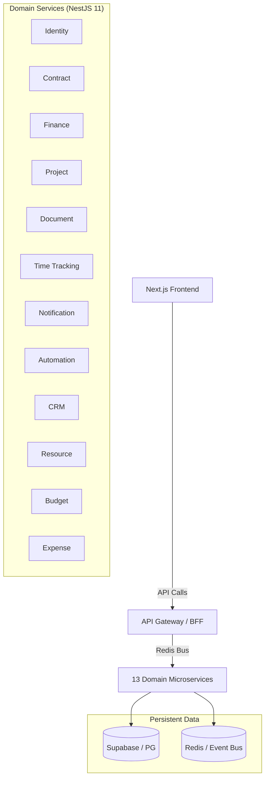

<h1 align="center">
   <strong>Velluma</strong>
</h1>

<p align="center">
  <strong>The Enterprise-Grade Freelancer Business Operating System (FBOS).</strong>
</p>

<p align="center">
  
  
  
  
  
</p>

## 🌌 The Vision
Velluma is a high-performance, strictly minimalist platform designed for elite freelancers. It combines a high-velocity **Proposal Engine** with a comprehensive **Execution Layer** and a **Secure Escrow Moat** to provide absolute financial transparency and legal integrity.

## 🏗️ Technical Architecture
Velluma is built as a **Turborepo Monorepo**, orchestrating 13 specialized NestJS microservices through an API Gateway (BFF) and a high-fidelity Next.js frontend.

### Implementation Status
| Module | Feature | Implementation Details |
| :--- | :--- | :--- |
| **Foundation** | ✅ **Core Matrix** | Next.js 16.1 (App Router), React 19.2, Tailwind v4. |
| **Design System**| ✅ **Cosmic Navy** | Monochrome (zinc-50), high-contrast, "Anti-Slop" (zero structural shadows). |
| **Proposals** | ✅ **Proposal Engine** | Custom TipTap editor, interactive pricing, digital signatures. |
| **Execution** | ✅ **Project Mastery** | Project Kanban/List views, global floating timer. |
| **Escrow** | ✅ **Financial Moat** | Secure finance dashboards, profitability matrix. |
| **BFF** | ✅ **API Gateway** | Request orchestration and Zod-based sanitization. |
| **Core Services** | ✅ **13 Microservices** | Domain-driven services (Identity, Contract, Finance, etc.). |

---

## 🏗️ Modular Design System
We adhere to **Clean Functional Minimalism**. Depth is created via `border-zinc-200` separation and intentional negative space, never via structural shadows.

- **Backgrounds**: `bg-zinc-50` (App) / `bg-white` (Surfaces)
- **Typography**: `Geist Sans`, `tracking-tight`, `text-zinc-900`
- **Animations**: `framer-motion` (subtle 0.15s fades)
- **Components**: Atomic primitives (Surface, Button, Typography, DataTable)

---

## 🛠️ Infrastructure Overview



---

## 🚀 Development Workflow

### 1. Prerequisites
- **Node.js 24+** (LTS)
- **Docker Desktop** (for local Redis/Postgres)

### 2. Ignition
```bash
# Install the ecosystem
npm install

# Lift local infrastructure
docker-compose up -d

# Spin up entire monorepo (Frontend + 13 Services)
npm run dev
```

The platform is live at `http://localhost:3000`.

---

## 🤝 Roadmap Highlights
- [x] **Phase 1**: Web Microservice & Core Foundation
- [ ] **Phase 2**: Real-time Stripe Connect Webhooks
- [ ] **Phase 3**: Mobile App (React Native)
- [ ] **Phase 4**: Advanced Automation Workflows

---

<p align="center">
  Built with precision by the Velluma Architect.<br>
  <em>Clean. Functional. Minimal. Massive.</em>
</p>