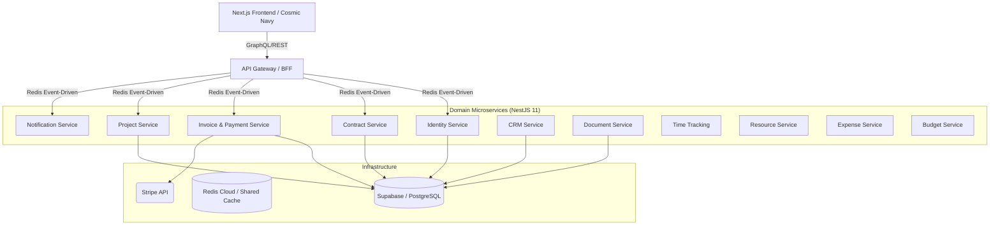

<h1 align="center">
   <strong>Velluma</strong>
</h1>

<p align="center">
  <strong>Streamlining freelance contracts and payments with security, transparency, and ease of use.</strong>
</p>

<p align="center">
  
  
  
  
  
</p>

---

## 🌌 The Vibe: Cosmic Navy Precision

Velluma is not just a tool; it's a **premium ecosystem** designed for high-stakes freelance governance. Our "Cosmic Navy" design philosophy blends deep space aesthetics with professional-grade clarity, ensuring that every contract signed and every payment funded feels secure, authoritative, and world-class.

### ✨ Elite Features

- **🛡️ Secure Escrow Governance**: Multi-party payment protection powered by Stripe Connect.
- **📜 Smart Contract Wizard**: AI-augmented legal templates tailored for modern digital work.
- **🖊️ Digital Signature Integrity**: High-fidelity electronic signatures with audit-ready verification.
- **📊 Real-time Project Hub**: Live milestone tracking and deliverable management in a single pane of glass.
- **🚢 Enterprise-Grade Microservices**: 12 dedicated domain services ensuring 99.9% fault tolerance.

---

## 🏗️ Architecture: Domain-Driven Excellence

Velluma's backbone is a sophisticated monorepo managed by **Turborepo**, utilizing an **API Gateway (BFF)** pattern to orchestrate 12 specialized microservices.



---

## 🎨 Visual Showcase

### Premium Dashboard Experience

*High-contrast dark mode with premium gradients and bento-grid layouts.*

---

## 🛠️ Performance-First Tech Stack

### Core Technologies
- **Frontend**: `Next.js 16.1` (App Router), `React 19.2`, `Tailwind CSS v4`
- **Backend**: `NestJS 11`, `Node.js 24+`, `Turborepo`
- **Data & Auth**: `Supabase` (PG + RLS), `JWT`
- **Payments**: `Stripe Connect` (Express/Custom)
- **Quality**: `ESLint 9` (Flat Config), `Playwright`, `Jest`

---

## 🚀 Quick Start (Local Development)

### 1. Prerequisites
- **Docker Desktop** (for Redis infrastructure)
- **Node.js 24+** (LTS recommended)

### 2. Ignite the Monorepo
```bash
# Install dependencies
npm install

# Start local infrastructure
docker-compose up -d

# Launch the entire ecosystem (Next.js + 12 Microservices)
npm run dev
```

The platform will be available at `http://localhost:3000`.

---

## 🔐 Security Standards

- **RLS Guardrails**: Row Level Security enabled on 100% of tables.
- **BFF Sanitization**: API Gateway enforces strictly typed request/response schemas.
- **Audit Logging**: Every contract modification is versioned and tracked.
- **KYC Integration**: Automated profile verification via Supabase Storage.

---

## 🤝 The Roadmap

| Status | Feature |
| :--- | :--- |
| ✅ Done | **Cosmic Navy Branding Overhaul** |
| ✅ Done | **12 Microservice Core Architecture** |
| ✅ Done | **Stripe Escrow Governance** |
| 🔄 Soon | **Mobile App (React Native)** |
| 📅 Later | **Blockchain Verification Layer** |

---

<p align="center">
  Built with ❤️ by the Velluma Team.<br>
  <em>Modern freelance commerce, perfected.</em>
</p>